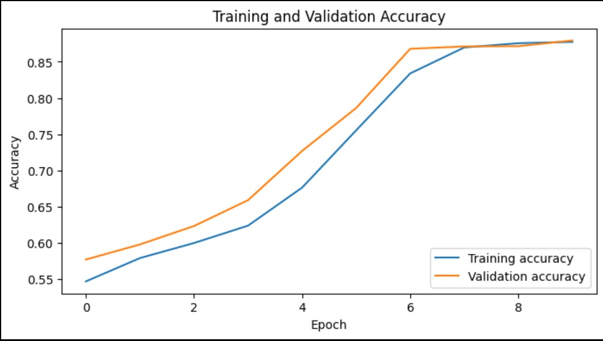
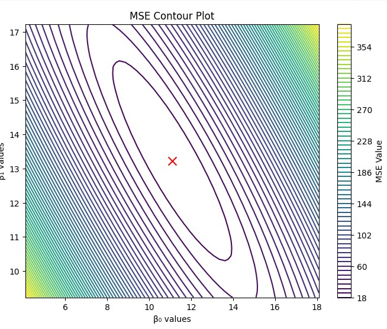

  
  

# [Welcome to my Data Science blog - portfolio](https://www.linkedin.com/in/josesvillalba/)

To analyze data and create algorithms based on it is just my passion. I created this webpage to share the summary and redirect you to some of my most relevant projects.

# [Exploratory Data Analysis - IOWA LIQUOR STORE](https://github.com/jsebastianvillalba/EDA/blob/main/EDA_project_JoseSebastian_Villalba.ipynb)

Through this Jupyter Notebook file, I use some basic data exploration techniques to perform EDA over the Iowa Liquor Store public dataset. The aim of this project is to clean, normalize, and analyze the database and the relationship between features to understand how to use this data to further ML developments. In this project, I have also performed some Hypothesis Testing over some hypothetical assumptions.

One of the coolest things that I learned by developing this project was to plot using Pyplotlib boxplot visualizations for categorical-quantitative relationships and scatter plots for quantitative feature relationships.

# [Classifying benign and malign cancer using SVM, Logistic, and KNN Regression models](https://github.com/jsebastianvillalba/classification/blob/main/Lab3_JoseSVillalba_AIML.ipynb)

In this Jupyter Notebook, I manage the Breast Cancer Wisconsin dataset available at https://archive.ics.uci.edu/dataset/17/breast+cancer+wisconsin+diagnostic and create three different Machine Learning Regression Models: Support Vector Machine, Logistic, and k Nearest Neighbors. The goal of this project is to analyze the effect of the Forward Sequential Feature Selector dimension reduction on the performance of each algorithm. During this project, I implemented SVM Hyperparameter tuning technique and the Standard Scaling algorithm for KNN. Besides, I visualized the confusion matrix using pyplot library from Matplotlib.

# [SIMULATIONS - Elevator Traffic Analysis using Numpy Arrays](https://github.com/jsebastianvillalba/jsebastianvillalba.github.io/blob/main/Elevator_Traffic_Simulation_.ipynb)

In this project, I have developed an elevator Montecarlo traffic simulation to calculate the average waiting time for an elevator in an office building using the probability distributions of population per floor and chances of having a determinate number of passengers in an elevator. The algorithm iterates ten thousand times to cover a wide range of possibilities and then calculates the estimated "Round Trip Time" of the elevator in seconds:

This simulation expands the simple Elevator Traffic Analysis based on a probability theoretical study as it not only shows the expected mean but also the probability distribution.

# [Essay vs Student-Generated Essay? Using LSTM for a Deep Learning Classification Problem](LSTM_Essay_Classification.ipynb)

In this project, I trained a CNN with LSTM using embeddings to train an essay classification model that accurately checks the probability that an essay was written using AI. This was my big first project using LLM. 

# [Regression- Hyperparameter Tuning Visualization via Contour Plots](0_linear_regression (1).ipynb)

This is a project that I adore so much, as I developed a code to visually understand how hyperparameter tuning (selecting the optimal B parameters) minimizes the MSE. 

# [WHO AM I?](https://www.linkedin.com/in/josesvillalba/)
I have 4 years of experience in Product Management in the construction and industrial sectors. I help companies to develop product strategies and business through Data Analytics and Artificial Intelligence.

I am specializing in Artificial Intelligence at the University of Winnipeg, PACE. During this program, I have developed Data Analytics projects for Business Intelligence and Customer Analytics; and an 83% precision Machine Learning algorithm in Google Cloud Platforms for predicting the blood pressure of a person given their lifestyle metrics. 

2023 is the year of Artificial Intelligence. I am a believer that through ethics and responsible development, AI will help humanity overcome challenges such as inequality, climate change, and agroindustrial production. I am passionate about reading AI papers and news and writing essays reflecting on how it is shaping our future. I have written two articles about AI: "Artificial Intelligence and the Future of the Canadian Workplace" and "AI Diversity and Inclusion". In these articles, I explore through statistics and humanities the fears of workers of being replaced by machines, and why is a must to be inclusive in AI development teams. 

During my work experience, I have had the opportunity of being a change leader. The development of new products and businesses brings change to interdisciplinary organizations, and workers who are reluctant to change need help and motivation. For them, I have created and provided educational product training through YouTube videos, conferences, online meetings, and personalized training sessions

## EDUCATION 

1y - Post-degree diploma. Artificial Intelligence
The University of Winnipeg

Bachelor of Science - BSc Mechanical Engineering
Universidad de los Andes.

